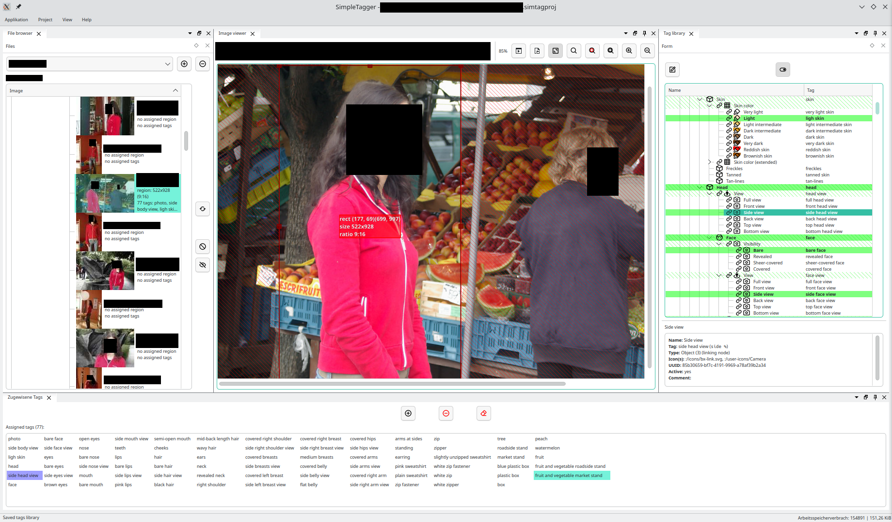

# SimpleTagger

Manual images tagging for Machine Learning purposes.

### WARNING - EARLY ALPHA STAGE

**This is an experimental software, with many functions still under development**

Fell free to experiment, but don't complain if it it causes any damage. Better safe than sorry, so only work on copies of your precious files [^1], and keep the "Backup on any change" option always **on**.

Licensed under: GNU General Public License v3.0 or later

[^1]: Although one of the premises of this software is to never ever modify source data, the alpha stage has its rights!

---

Sneak preview:

*On the left - list of images to tag. In the middle - currently tagged image. The red frame is a cropping region. Below - tags assigned to the current image. On the right - tags library. The tags marked green have been just assigned to this image*

## Functionality

Basic goal: high quality manual tagging

### Tags library

To tag an image, simply double click a tag in the hierarchical library

Compared with simple text inputs, this leads to better consistency and completness. Consistency, because the same elements consequently get the same tags. Completness, because browsing the branches in the hierarchical library, it's easy to spot forgotten elements.

The library is easy to adapt for custom needs. Although the software comes with a library of predefined tags, everything can be extended adapted by the user. Elements can be added, deleted, moved around...

The library is only loosely coupled with the images' tags, so the library can be reorganized without damaging existing sets

The library has an internal links system (think filesystem links, not hyperlinks). This enables reusing portions of the tree in multiple places. For example, if you create a list of colors tags (red, green, ...) in one place, and a list of furniture tags in another (chair, table, ...), you can use links to automatically generate all color variants for your furnitures (red chair, green chair, ..., red table, green table, ...). 

(and it's still hierarchical, so you can have multiple levels of links)

### Image cropping

For each image, a relevant region can be selected. Only this region will end up in the later exported data.

This is non-destrucible - no source image is ever modified. The selected region is stored along with tags. Actual cropping happens during export and affects only output files.

Aspect ratio control - if enabled, the selector will stick to allowed aspect ratios only. This way, if the images are later bucketed based on their aspect ratios, you can limit the number of buckets.

### Project management

A project consists of set of input directories, list of excluded files, rules for tags (which tags to take, which tags to omit)

This is to support "tag once, reuse many times" approach to tagging. If a collection of images gets tagged once, it should be easy to build multiple projects around them.

Exclusion is used to exclude an image from one project, without affecting it's availability for the others (and without moving any source files around).

Tags rules can be used to:
 * Automatically exclude/include images in the project based on presence/absence of specific tags (e.g. to include only images with cars, but exclude those with trucks)
 * Drop some tags for the purpose of a single project, without removing them from the images (e.g. to prevent "tires" tags from occuring in the exported set, without untagging the images)

Various statistics can be generated for the project: distribution of specific tags, distribution of image sizes, aspect ratios...

With these statistics, it should be easier to further improve your data set quality. For example, if the statistics show underrepresentation of "red car" tags compared with all other car colors, it may be an indication to extend the data set by more images of red cars. On the other hand, overrepresentation of red cars may suggest a need to exclude some of such images from the project.

### Export of data sets

All images in the project, that have not been excluded (either manually or by the project rules), are cropped, scaled and packed together with their tags in a format suitable for further ML tools (for example, an archive of .jpg and .txt files containing images and their tags respectively).

Again, no source data is modified. 

### Flexible UI

Desktop UI (based on Qt libraries) designed with flexibility in mind. The user can easily adjust the application to their own needs.

### Local, desktop, multiplatform

Full local processing, desktop UI, portability across various platforms.

Written in C++, based on Qt, both of which support many popular OSes. So far tested only on Linux/X11, but it should be easy to port to e.g. Windows or macOS.

## Building

### Linux

#### 1. Install the following dependencies:

 - git
 - gcc 14
 - binutils
 - cmake 3.30
 - ninja
 - qt (base only) 6.7

On Arch and like, it should be enough to run

    pacman -S git gcc binutils cmake ninja qt6-base

Packge names in other distribution may be different. Remember to also install development package ("-dev" or "-devel") for qt-base, if your distro delivers them separately.

#### 2.Clone this project repository:

    git clone 'https://github.com/well-thats-funny/simpletagger.git' simpletagger-cxx

#### 3. Create a build directory and enter it:

    mkdir build
    cd build

#### 4. Configure the project with CMake

    
    cmake .. -DCMAKE_BUILD_TYPE=RelWithDebInfo -GNinja

Note that this requires a working internet connection, as additional minor dependencies are downloaded in this step.

#### 5. Run the build:

    cmake --build . --target simpletagger-cxx

#### 6. Run the application:

    ./src/simpletagger-cxx

### Other platforms

As the software has not been yet tested on any other platform than Linux, it's up to you to try ;).

On UNIX and like systems, build steps for Linux should be a good start. On Windows, it should be possible to use CMake to generate a MSVC project that can be then built using appropriate Microsoft tools. Remember that you'll also need Qt 6.7 dev package or SDK (the application only uses "Qt-Core" module).

If you succeed with this, please let me know!

### Credits

SimpleTagger

https://github.com/well-thats-funny/simpletagger

Copyright (C) 2024 [fdresufdresu@gmail.com](mailto:fdresufdresu@gmail.com)

This program comes with ABSOLUTELY NO WARRANTY. This is free software, and you are welcome to redistribute it under license onditions.

Licensed under: GNU General Public License v3.0 or later

Used components:

* Qt Framework 6: https://www.qt.io (under the terms of LGPL v3 license)
* Qt Advanced Docking: https://github.com/githubuser0xFFFF/Qt-Advanced-Docking-System (under the terms of LGPL v2.1 license)
* Boxicons: https://boxicons.com and https://github.com/atisawd/boxicons (under the terms of MIT and CC 4.0 licenses)
* GSL Lite: https://github.com/gsl-lite/gsl-lite (under the terms of MIT license)
* Tracy: https://github.com/wolfpld/tracy (under the terms of 3-clause BSD license)
